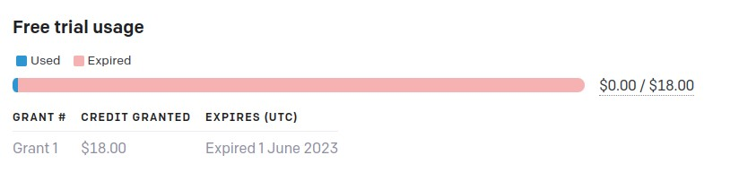
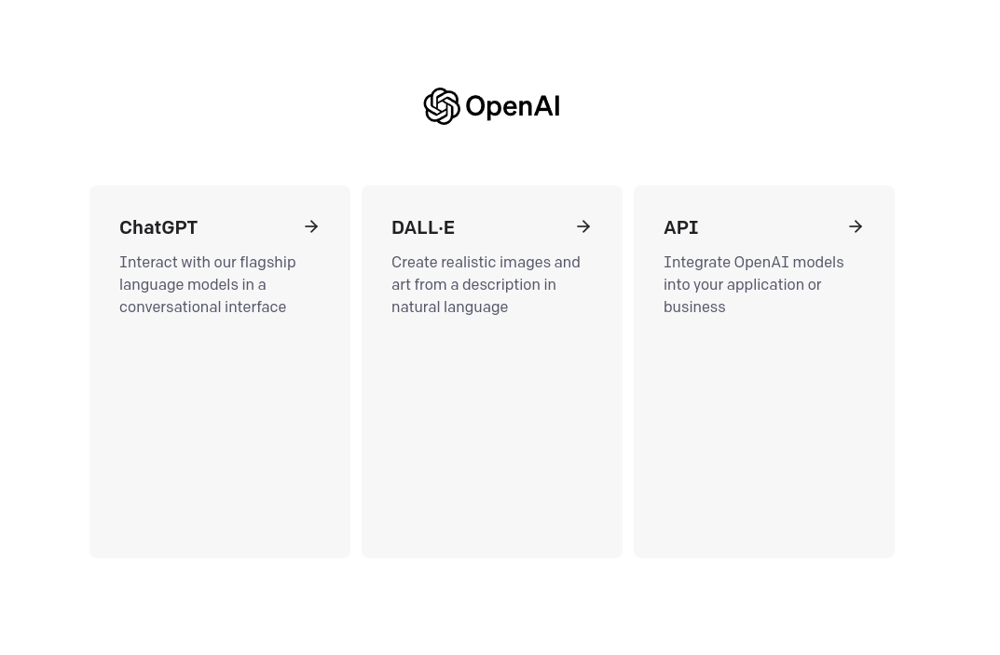
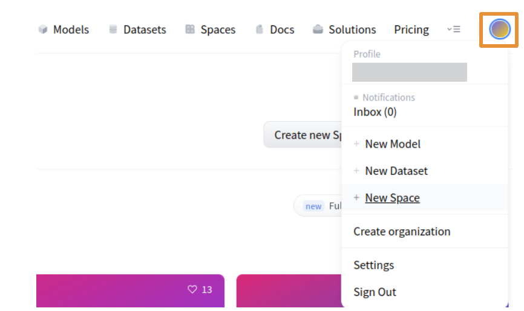
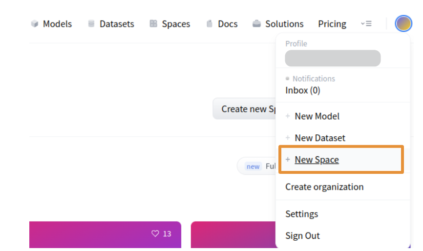
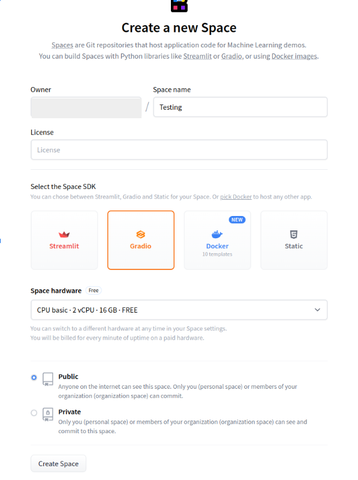
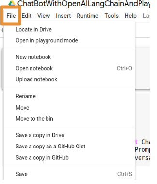
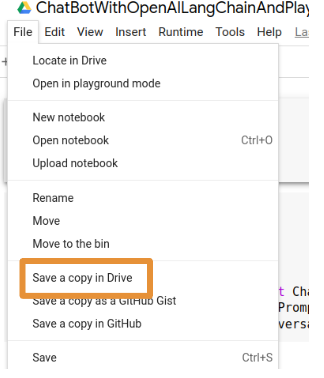

# Generative AI with Speech output

[Handbook](https://inky-ironclad-8d2.notion.site/Generative-AI-Workshop-bfb0123ccf6945ebbfa5bf3328917423), [This Handbook](https://inky-ironclad-8d2.notion.site/ChatBot-with-Open-AI-LangChain-and-PlayHT-b518566d30194da093bd1b21f82085a4)

<b>Prerequisites</b>

- **Existing Open AI Account**

    - Check whether you have a limit to using the OpenAI API

    - The below screenshot indicated it is expired by June 1. So, you need to create a new account for free credits or purchase premium plan.

        

- **Creating OpenAI Account with New Mail or Mobile Number**

    - Open <a href="https://openai.com/" target="_blank">https://openai.com</a>

    - Click on `Sign Up` button

    - Choose your preffered `Sign Up` method

    - After logged in click <a href="https://platform.openai.com/apps" target="_blank">here</a> to see below options

        

- **Create a HuggingFace Account**

    - Open <a href="https://huggingface.co/" target="_blank">https://huggingface.co/</a>

    - Click on `Sign Up` button

    - Enter your details and Click on `Sign Up`

    - Verify your email address

- **Create a New Space in HuggingFace Account**

    - Click on `Profile` icon top right corner

        

    - Click on `New Space`

        

    - Enter details of your new space

        

- **Create PlayHT Account**

    - Open <a href="https://play.ht/" target="_blank">https://play.ht/</a>

    - Click on `Log in`

    - Since you don't have an account, go to <a href="https://play.ht/signup/" target="_blank">https://play.ht/signup/</a>

    - Choose your preferred `Sign Up` method

    - Account will be created and you will be redirected to your dashboard

- **Clone your Voice to PlayHT**

    - Before cloning, get ready with a 45 second clean audio of your voice

    - Open <a href="https://play.ht/studio/voice-cloning/" target="_blank">https://play.ht/studio/voice-cloning/</a>

    - Click on `+ Create a New Clone`

    - Click on `Instant`

    - Enter Voice Name and Upload the File

    - Click on `Create`

    - Your voice will be cloned

- **Open the below provided Colab link**

    

- **Copying Code to your Google Drive**

    - On the top left corner of Google Colab Notebook you can find `File`, click on it

        

    - Click on `Save a copy in Drive`

        

    - If you are not logged in to your Google Account, please log into it

    - Once you are successfully logged in a new Google Colab Notebook with the given code will be opened

