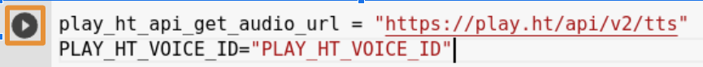

# ChatBot with Open AI, LangChain and PlayHT

[Handbook](https://inky-ironclad-8d2.notion.site/Generative-AI-Workshop-bfb0123ccf6945ebbfa5bf3328917423), [This Handbook](https://inky-ironclad-8d2.notion.site/ChatBot-with-Open-AI-LangChain-and-PlayHT-b518566d30194da093bd1b21f82085a4)

<!------------------Prerequisites-------------------------->

<details>
<summary><b>Prerequisites</b></summary>

- **Existing Open AI Account**

    - Check whether you have a limit to using the OpenAI API

    - The below screenshot indicated it is expired by June 1. So, you need to create a new account for free credits or purchase premium plan.

        

- **Creating OpenAI Account with New Mail or Mobile Number**

    - Open <a href="https://openai.com/" target="_blank">https://openai.com</a>

    - Click on `Sign Up` button

    - Choose your preffered `Sign Up` method

    - After logged in click <a href="https://platform.openai.com/apps" target="_blank">here</a> to see below options

        

- **Create a HuggingFace Account**

    - Open <a href="https://huggingface.co/" target="_blank">https://huggingface.co/</a>

    - Click on `Sign Up` button

    - Enter your details and Click on `Sign Up`

    - Verify your email address

- **Create a New Space in HuggingFace Account**

    - Click on `Profile` icon top right corner

        

    - Click on `New Space`

        

    - Enter details of your new space

        

- **Create PlayHT Account**

    - Open <a href="https://play.ht/" target="_blank">https://play.ht/</a>

    - Click on `Log in`

    - Since you don't have an account, go to <a href="https://play.ht/signup/" target="_blank">https://play.ht/signup/</a>

    - Choose your preferred `Sign Up` method

    - Account will be created and you will be redirected to your dashboard

- **Clone your Voice to PlayHT**

    - Before cloning, get ready with a 45 second clean audio of your voice

    - Open <a href="https://play.ht/studio/voice-cloning/" target="_blank">https://play.ht/studio/voice-cloning/</a>

    - Click on `+ Create a New Clone`

    - Click on `Instant`

    - Enter Voice Name and Upload the File

    - Click on `Create`

    - Your voice will be cloned

- **Open the below provided Colab link**

    <a href="https://colab.research.google.com/drive/1LS-w4UuAWRQfX_zM1WHXdCfofleI91g0?usp=sharing" target="_blank"></a>

- **Copying Code to your Google Drive**

    - On the top left corner of Google Colab Notebook you can find `File`, click on it

        

    - Click on `Save a copy in Drive`

        

    - If you are not logged in to your Google Account, please log into it

    - Once you are successfully logged in a new Google Colab Notebook with the given code will be opened
</details>

<!--------------------Install the Required Packages---------------------------->

<details>
<summary><b>Install the Required Packages</b></summary>

- Click on Play button to Install the Packages

    
</details>

<!--------------------Import the Required Packages----------------------------->

<details>
<summary><b>Import the Required Packages to build the application</b></summary>

- Click on Play button to Import the Packages

    
</details>

<!------------Assign API Keys and User IDs----------------------->

<details id="playht-ids">
<summary><b>Assign API Keys and User IDs</b></summary>

- How to get OpenAI API Key?

    - Go to <a href="https://platform.openai.com/account/api-keys/" target="_blank">https://platform.openai.com/account/api-keys</a>

    - Click on `+ Create new secret key`

    - Copy the secret key for your use

- Assign OpenAI API Key

    - Replace `OPENAI_API_KEY` with your OpenAI API Key

        

- How to get PlayHT User ID and PlayHT API Key?

    - Login to PlayHT - <a href="https://play.ht/" target="_blank">https://play.ht/</a>

    - Go to <a href="https://play.ht/studio/api-access/" target="_blank">https://play.ht/studio/api-access/</a>

    - Generate the Secret Key

        

    - Replace `PLAY_HT_API_KEY` with Secret Key you copied

        

    - Replace `PLAY_HT_USER_ID` with User ID you copied

        
</details>

<!-------------Set OpenAI API Key to Environmental Variables------------------->

<details>
<summary><b>Set OpenAI API Key to Environmental Variables</b></summary>

- Click on Play button to set it as a Key

    
</details>

<!-------------------Creating user voice id on PlayHT--------------------------------->

<details>
<summary><b>Assign your Voice to a variable and set the URL to a variable</b></summary>

- How to get your Voice ID

    - Go to <a href="https://docs.play.ht/reference/api-list-cloned-voices" target="_blank">https://docs.play.ht/reference/api-list-cloned-voices</a>

    - In the right side section, select the language `Python`

        

    - Enter Authorization as `Bearer PLAY_HT_API_KEY` replace `PLAY_HT_API_KEY` with your API Key refer [here](#playht-ids)

        

    - Enter X-USER-ID as your `PLAY_HT_USER_ID` refer [here](#playht-ids)

        

    - Click on `Try it!`

        

    - If the Response says `200` then you have successfully created your Voice ID

        

    - Copy the `id` from the Response like `s3://.../.json`

    - Now you can use that `id` in the `get_payload` as a value for voice

    - Replace `PLAY_HT_VOICE_ID` with your copied `id`

        

    - Click on Play button to set the values

        
</details>

<!----------Assigning the values for template, prompt, and memory----------------->

<details>
<summary><b>Assigning the values for template, prompt, and memory</b></summary>

- You can update the first line of the template `You are a helpful assistant to answer user queries` with `<Prompts>` given in <a href="./prompts-and-examples.md" target="_blank">Prompts and Examples</a>

- Click on Play button

    
</details>

<!----------Initializing LLM Chain using OpenAI--------->

<details>
<summary><b>Initializing LLM Chain using OpenAI</b></summary>

- Using `ChatOpenAI` method we are creating an <a href="https://js.langchain.com/docs/api/chains/classes/LLMChain" target="_blank">LLM Chain</a>

- Click on Play button

    
</details>

<!-----------Setting headers----->

<details>
<summary><b>Setting headers</b></summary>

- Click on Play button

    
</details>

<!-------Define functions to fetch Audio Response from PlayHT----->

<details>
<summary><b>Define functions to fetch Audio Response from PlayHT</b></summary>

- Click on Play button

    
</details>

<!---------Define a function to generate the response for the question you ask----------->

<details>
<summary><b>Define a function to generate the response for the question you ask</b></summary>

- Click on Play button

    
</details>

<!---------Define a function to generate the Audio response and Create a ChatInterface using the Gradio--------->

<details>
<summary><b>Define a function to generate the Audio response and Create a ChatInterface using the Gradio</b></summary>

- We are defining a `chat_bot_response` to return either an audio response format if audio file is fetched properly or returns a string response if it is an error

- We are creating the ChatInterface from gradio and providing a function `chat_bot_response` and also examples

- Check for other arguments [here](https://www.gradio.app/docs/chatinterface)

- Click on Play button to create an interface

    
</details>

<!------Launch your ChatBot with Gradio App------>

<details>
<summary><b>Launch your ChatBot with Gradio App</b></summary>

- Click on Play button to launch the App

    
</details>

### Now you can try asking questions in your ChatBot and receive response as your Voice

<!-----If you are getting any errors----->

<details>
<summary><b>If you are getting any errors</b></summary>

- Keep print statements to identify the issue

- To identify the error you are getting please add `debug = True` while launching the gradio app

    ```python
    if __name__ == "__main__":
        demo.launch(debug = True)
    ```

- You can add try and except block to handle the errors

    ```python
    def get_text_response(user_message,history):
        try:
            response = llm_chain.predict(user_message = user_message)
        except Exception as e:
            print("Error:", e)
            try:
                print("Error:", e.error.message)
                response = "Failed to reply: " + e.error.message
            except Exception as e:
                response = "Failed to reply"
        return response
    ```
</details>